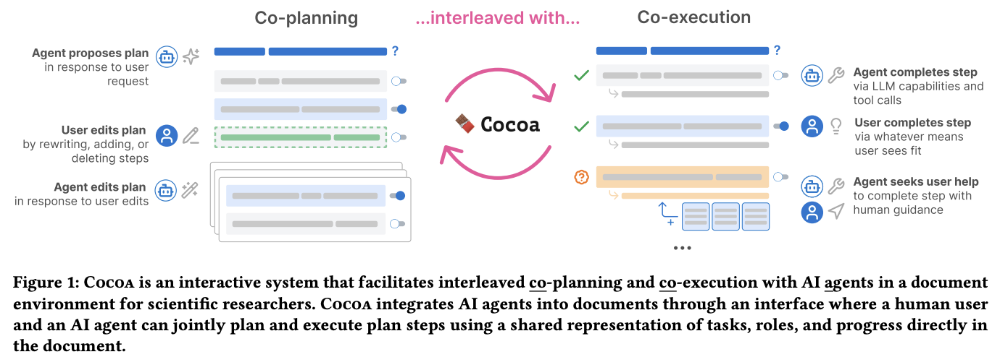
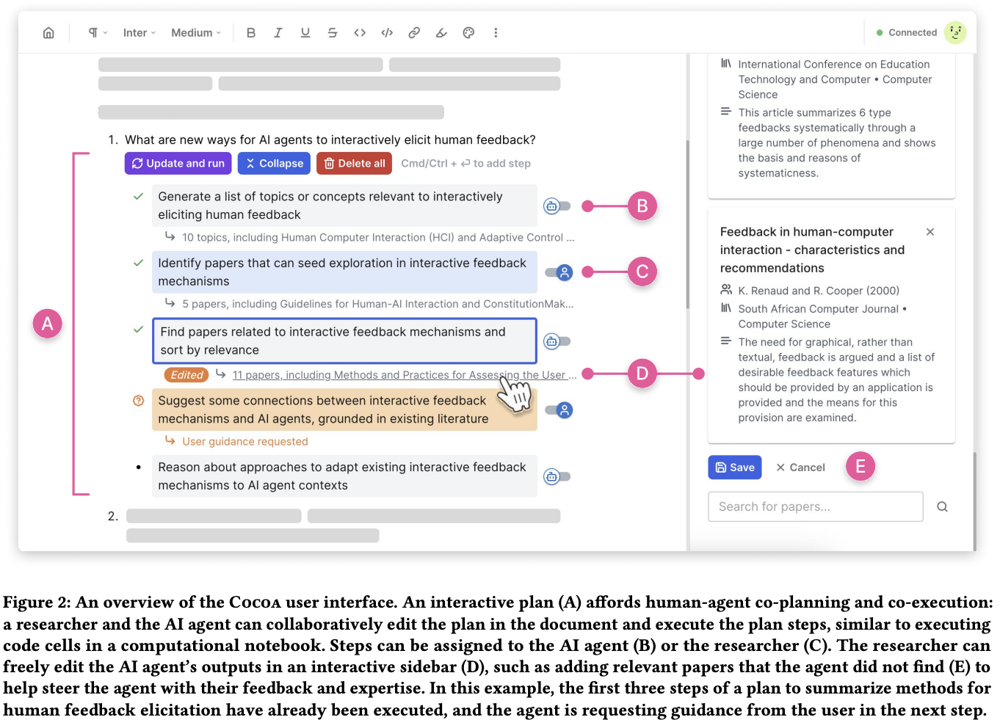

<!-- TODO: to be placed in hypo gen dir -->
<!-- save as: <last-name-of-first-author>_<paper-title>.md -->

# Feng et al.: Cocoa: Co-Planning and Co-Execution with AI Agents

## One Sentence
<!-- summarize the paper in one sentence, ideally with one figure as well -->

Similar to computational notebook (Colab?), Cocoa lets humans and agents to jointly edit and execute the plan.

## More Sentences
<!-- additional sentences -->

## Key Points
<!-- the most important things in this paper -->

<!-- ### Here is a point -->

## Other Notes
<!-- other things, not so important, but good to know -->

## Take-Away
<!-- critiques, ideas, actionable things, etc. -->