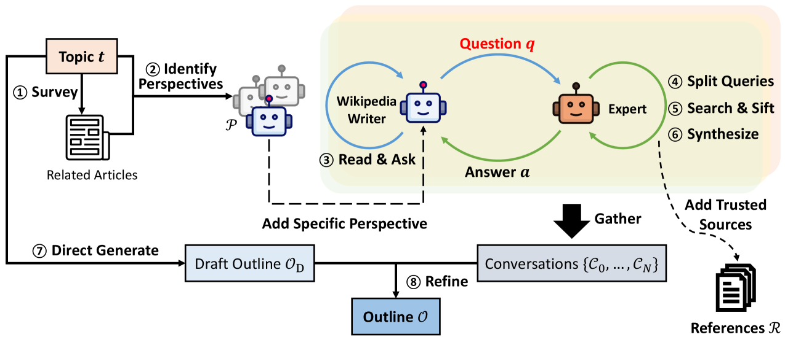

<!-- save as: <last-name-of-first-author>_<paper-title>.md -->

# Shao et al.: Assisting in Writing Wikipedia-like Articles From Scratch with Large Language Models

## One Sentence
<!-- summarize the paper in one sentence, ideally with one figure as well -->

> STORM models the pre-writing stage by (1) discovering diverse perspectives in researching the given topic, (2) simulating conversations where writers carrying different perspectives pose questions to a topic expert grounded on trusted Internet sources, (3) curating the collected information to create an outline.

Figure 2: STORM starts from a topic, surveys related Wikipedia pages to induce multiple perspectives, runs perspective-guided conversations between a simulated writer and a source-grounded expert, then uses those conversations plus the model's internal knowledge to draft and refine an outline.

## More Sentences
<!-- additional sentences -->

## Key Points
<!-- the most important things in this paper -->

### Pre-writing is the main technical object
The paper treats "write a Wikipedia-like article from scratch" as two linked problems: (1) research and outline creation, and (2) grounded section-by-section article generation. The distinctive contribution is mostly in the first stage: using perspective-guided question asking to collect broader, better organized information before drafting.

### Evaluation is built around a fresh benchmark
FreshWiki uses recent, high-quality Wikipedia articles to reduce train/test leakage, then evaluates both outline quality and final article quality. For outlines, the paper compares generated headings to human article headings using heading soft recall and heading entity recall.

## Other Notes
<!-- other things, not so important, but good to know -->

### Might be related to Flower & Hayes' cognitive process model of writing?
> ... the human writing process which usually includes phases of pre-writing, drafting, and revising (Rohman, 1965; Munoz-Luna, 2015)

Yes, but with an important caveat. Shao et al. explicitly adopt a staged view of writing--pre-writing, drafting, revising--and operationalize only the pre-writing part as research plus outline construction. That is adjacent to Flower and Hayes, especially their emphasis on writing as problem solving with planning, translating, and reviewing processes.

The caveat is that Flower and Hayes' cognitive process theory is not just a linear stage model. Their 1981 model treats planning, translating, and reviewing as recursive processes coordinated by a monitor, drawing on the writer's long-term memory and the task environment. In that sense, STORM is closer to automating one locally separable slice of the writing process--planning/research/outline formation--than to modeling the full Flower-Hayes loop.

Potentially useful framing: STORM turns "planning" into a multi-agent information-seeking procedure. The perspective-specific writers help define the rhetorical/problem space; the source-grounded expert supplies task-environment information; the final outline is a planning artifact that later constrains drafting. What it does not yet model very deeply is the monitor-like control over when to re-plan, revise goals, or loop back after drafting.

Sources: Shao et al. (2024), Figure 2 and Section 3; Flower & Hayes (1981), "A Cognitive Process Theory of Writing"; Flower & Hayes (1980), "The Cognition of Discovery: Defining a Rhetorical Problem."

## Take-Away
<!-- critiques, ideas, actionable things, etc. -->

### Create a dataset for evaluating their own approach
We can borrow such an approach (as opposed to coming up with some ad hoc tasks as part of the study protocol).
